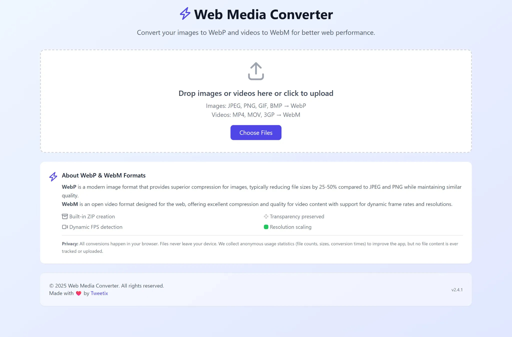

# 🎬 Web Media Converter

> A modern, fast, and secure SaaS media converter that transforms your images to WebP and videos to WebM format directly in your browser.

[](#license)
[](https://www.typescriptlang.org/)
[](https://reactjs.org/)
[](https://vitejs.dev/)
[](https://tailwindcss.com/)



## 🌐 Try It Now

**Use the live application:** [https://app.webmediaconverter.com/](https://app.webmediaconverter.com/)

> **Note:** This is a proprietary SaaS application. The source code is available for viewing and contributing only. Please use the official web application above for all media conversions.

## ✨ Features

### 🖼️ **Image Conversion (WebP)**
- 🚀 **Lightning Fast**: Client-side processing with HTML5 Canvas API
- 🎨 **Transparency Support**: Preserves alpha channels for PNG files
- 🎯 **Quality Control**: Adjustable compression (10-100%)
- 📏 **Smart Resizing**: Automatically resize images while maintaining aspect ratio
- 📏 **Dimension Control**: Global and per-image resize settings with 2048px defaults

### 🎬 **Video Conversion (WebM)**
- 🎥 **Format Support**: Convert MP4, MOV, 3GP to WebM (optimized for web compatibility)
- 🎬 **Dynamic FPS Detection**: Automatically detects and preserves original frame rates
- ⚙️ **Frame Rate Control**: Choose from industry-standard FPS (12, 15, 24, 25, 30, 48, 50, 60)
- 📐 **Resolution Scaling**: Multiple resolution presets with custom dimension support
- 🎚️ **Advanced Quality Control**: CRF-based quality settings for optimal compression
- 🔊 **Audio Options**: Include or exclude audio tracks during conversion
- 🖼️ **Smart Previews**: Automatic thumbnail generation for converted videos
- 🔍 **Lightbox Viewer**: Click to preview converted media in fullscreen
- ⚡ **Browser-based**: Uses MediaRecorder API with VP8/VP9 codec support

### 🛠️ **Universal Features**
- ⚡ **Lightning-Fast Processing**: Parallel conversion of up to 3 files simultaneously (60-80% faster)
- 📦 **Smart Batch Processing**: Convert multiple files with intelligent memory management
- 💾 **Smart Downloads**: Auto-generates ZIP files for multiple conversions
- 🔒 **Privacy First**: No server uploads - everything stays in your browser
- 📱 **Responsive Design**: Works seamlessly on all devices
- ⚡ **Modern Stack**: Built with React 19, TypeScript, and Vite
- 🛡️ **Security Focused**: Content Security Policy and input validation
- 📊 **File Insights**: Shows original vs compressed file sizes and dimension changes
- 🧠 **Advanced Memory Management**: Automatic cleanup with memory pressure monitoring
- 🔄 **Reliable Processing**: Automatic retry mechanism for failed conversions
- 📈 **User Analytics**: Google Analytics 4 integration for understanding usage patterns and improving the app
- 🎨 **Modern UI**: Custom Select components with Headless UI for enhanced accessibility
- 🔒 **Privacy Disclosure**: Transparent analytics notice with clear privacy commitments
- ⚙️ **Adaptive Performance**: Dynamic concurrent processing based on device hardware

## 🎯 Supported Formats

### 🖼️ **Images → WebP**
| Input Formats | Output Format            | Max Size |
| ------------- | ------------------------ | -------- |
| JPEG, JPG     | WebP                     | 50MB     |
| PNG           | WebP (with transparency) | 50MB     |
| GIF           | WebP                     | 50MB     |
| BMP           | WebP                     | 50MB     |

### 🎬 **Videos → WebM**
| Input Formats | Output Format | Max Size | Features                        |
| ------------- | ------------- | -------- | ------------------------------- |
| MP4           | WebM          | 500MB    | Full support with FPS detection |
| MOV           | WebM          | 500MB    | Full support with FPS detection |
| 3GP           | WebM          | 500MB    | Full support with FPS detection |

> **Note**: AVI and WMV formats are not supported due to browser compatibility limitations. For best results, please use MP4, MOV, or 3GP formats.

## 🚀 Using the Application

### For Users
Simply visit [https://webmediaconverter.netlify.app/](https://webmediaconverter.netlify.app/) to start converting your images to WebP and videos to WebM format instantly.

### For Contributors
This repository is open for contributions. You can:
- Report bugs and issues
- Suggest new features
- Submit pull requests for improvements
- Provide feedback and ideas

**Note:** This source code is for contribution purposes only. Please do not attempt to deploy or host this application yourself.

## 🛠️ Conversion Settings

### 🖼️ **Image Resizing**

The converter includes intelligent image resizing to help reduce file sizes while maintaining quality:

### **Global Resize Settings**
- **Default**: 2048px × 2048px maximum dimensions
- **Behavior**: Applied to all images automatically
- **Smart Scaling**: Only downsizes large images (never upscales)
- **Aspect Ratio**: Always preserved during resizing

### **Per-Image Control**
- **Individual Override**: Check the resize box for any image to use custom dimensions
- **Flexible Settings**: Each image can have different resize settings
- **Visual Feedback**: See original → final dimensions before conversion

### **How Image Resizing Works**
1. **Upload images** → Automatically resized to global settings (2048px default)
2. **Adjust global settings** → Changes apply to all images without individual overrides
3. **Enable individual resize** → Check the box to set custom dimensions for specific images
4. **Apply to All** → Reset all images to use current global settings

### 🎬 **Video Conversion Settings**

Configure video output quality and audio options:

### **Bitrate Control**
- **Range**: 100-10000 kbps
- **Default**: 1000 kbps (recommended for web)
- **Higher bitrate** = better quality but larger file size

### **Audio Options**
- **Include Audio**: Toggle to include/exclude audio tracks
- **Default**: Audio enabled
- **Note**: Audio inclusion depends on browser support and source video

### **How Video Conversion Works**
1. **Upload videos** → Automatic thumbnail generation for preview
2. **Adjust global settings** → Apply to all videos without individual overrides
3. **Individual settings** → Customize bitrate and audio per video (future feature)
4. **Convert** → Browser-based WebM encoding using MediaRecorder API


## 📦 Development Commands (Contributors Only)

| Command                 | Description                               |
| ----------------------- | ----------------------------------------- |
| `npm run dev`           | Start development server                  |
| `npm run build`         | Build for production                      |
| `npm run build:check`   | Type check + build                        |
| `npm run build:analyze` | Bundle analysis with visualization        |
| `npm run build:profile` | Build with performance profiling          |
| `npm run preview`       | Preview production build                  |
| `npm run type-check`    | Run TypeScript type checking              |
| `npm run format`        | Format code with Prettier                 |
| `npm run format:check`  | Check code formatting                     |
| `npm run perf:preview`  | Build and preview for performance testing |

> **Important:** These commands are for development and contribution purposes only. Do not use them to deploy or host this application.

## 🛡️ Security Features

- **Content Security Policy**: Prevents XSS attacks
- **File Size Validation**:
  - Images: 50MB maximum file size
  - Videos: 500MB maximum file size
- **Dimension Limits**: 16,384px maximum width/height for input images
- **Resize Validation**: Smart bounds checking for custom resize dimensions
- **Input Sanitization**: Secure filename handling
- **Format Validation**: Strict file type checking for images and videos
- **Client-Side Only**: No data ever leaves your browser

## 🏗️ Project Structure

```
web-media-converter/
├── public/
│   ├── favicon.png
│   └── ...
├── src/
│   ├── components/          # React components
│   │   ├── ui/             # Reusable UI components
│   │   │   ├── Button.tsx  # Button component with variants
│   │   │   ├── Input.tsx   # Input component with ref forwarding
│   │   │   ├── Card.tsx    # Card layout components
│   │   │   ├── ProgressBar.tsx # Progress indicator
│   │   │   ├── StatusBadge.tsx # Status display
│   │   │   └── index.ts    # UI components exports
│   │   └── features/       # Feature-specific components
│   │       ├── Header.tsx  # App header
│   │       ├── UploadArea.tsx # File upload interface
│   │       ├── ConversionSettings.tsx # Quality & resize controls
│   │       ├── FilesList.tsx # Files management
│   │       ├── FileItem.tsx # Individual file display
│   │       ├── InfoCard.tsx # WebP information
│   │       └── index.ts    # Feature components exports
│   ├── hooks/              # Custom React hooks
│   │   ├── useFileManager.ts # File state management
│   │   ├── useConversion.ts # Conversion logic
│   │   ├── useDownload.ts  # Download functionality
│   │   ├── useDragAndDrop.ts # Drag & drop handling
│   │   └── index.ts        # Hooks exports
│   ├── services/           # Business logic services
│   │   ├── conversionService.ts # Image conversion functions
│   │   └── videoConversionService.ts # Video conversion functions
│   ├── utils/              # Utility functions
│   │   ├── zipUtils.ts     # ZIP file creation
│   │   └── analytics.ts    # Google Analytics tracking
│   ├── types.ts            # TypeScript definitions
│   ├── App.tsx             # Main application (95 lines)
│   ├── main.tsx            # Application entry point
│   └── index.css           # Global styles
├── dist/                   # Production build output
├── netlify.toml           # Netlify configuration
├── package.json           # Dependencies and scripts
├── tsconfig.json          # TypeScript configuration
├── tailwind.config.js     # Tailwind CSS configuration
└── vite.config.ts         # Vite configuration
```

## 🔧 Tech Stack

### Core Technologies
- **[React 19](https://reactjs.org/)** - UI framework with latest features
- **[TypeScript 5.6](https://www.typescriptlang.org/)** - Type-safe JavaScript
- **[Vite 6.x](https://vitejs.dev/)** - Lightning-fast build tool

### Styling & UI
- **[Tailwind CSS 3.4](https://tailwindcss.com/)** - Utility-first CSS framework
- **[FontAwesome](https://fontawesome.com/)** - Professional icon library
- **CSS Grid & Flexbox** - Modern layouts
- **Component Architecture** - Modular UI with separation of concerns

### Development Tools
- **[Prettier](https://prettier.io/)** - Code formatting
- **[PostCSS](https://postcss.org/)** - CSS processing
- **[Autoprefixer](https://autoprefixer.github.io/)** - CSS vendor prefixes

### Analytics & Monitoring
- **[Google Analytics 4](https://analytics.google.com/)** - User behavior tracking and insights
- **Custom Event Tracking** - Conversions, downloads, uploads, and settings changes
- **Privacy-Focused** - No personally identifiable information collected

## 🤝 Contributing

We welcome contributions to improve this SaaS application! You can help by:

### 🐛 Reporting Issues
- [Open an issue](https://github.com/yourusername/web-media-converter/issues/new) for bugs
- Provide detailed steps to reproduce
- Include screenshots if applicable

### 💡 Suggesting Features
- [Request a feature](https://github.com/yourusername/web-media-converter/issues/new) with a clear use case
- Explain the problem it solves
- Describe your proposed solution

### 🔧 Code Contributions
1. **Fork the repository**
2. **Create a feature branch from main**
   ```bash
   git checkout -b feature/amazing-feature
   ```
3. **Make your changes**
4. **Run tests and formatting**
   ```bash
   npm run type-check
   npm run format
   ```
5. **Commit your changes**
   ```bash
   git commit -m 'Add amazing feature'
   ```
6. **Push to the branch**
   ```bash
   git push origin feature/amazing-feature
   ```
7. **Open a Pull Request to the main branch**

### 🚀 Deployment Workflow

**Branch Strategy:**
- **`main`** - Development branch (does NOT auto-deploy)
- **`production`** - Production branch (auto-deploys to Netlify)

**How to Deploy:**
1. Make and test changes on the `main` branch
2. When ready to deploy, merge `main` into `production`:
   ```bash
   git checkout production
   git merge main
   git push origin production
   ```
3. Netlify will automatically deploy the `production` branch

This workflow allows you to push changes to `main` as often as needed without triggering deployments. Only merges to `production` will deploy to the live site.

### 📋 Contribution Guidelines
- Follow the existing code style
- Write clear commit messages
- Test your changes thoroughly
- Update documentation if needed
- All contributions become part of the proprietary codebase

> **Note:** By contributing, you agree that your contributions will be subject to the same proprietary license as the rest of the project.

## 📝 License

This project is licensed under a **Proprietary License** - see the [LICENSE](LICENSE) file for details.

**Key Points:**
- ✅ View source code for educational purposes
- ✅ Contribute improvements and suggestions
- ✅ Use the official web app at [https://webmediaconverter.netlify.app/](https://webmediaconverter.netlify.app/)
- ❌ Deploy, host, or distribute this software
- ❌ Use for commercial purposes without permission
- ❌ Create derivative works

## 🐛 Bug Reports & Feature Requests

Found a bug or have a feature idea? Please [open an issue](https://github.com/yourusername/web-media-converter/issues) with:

- **Bug Reports**: Steps to reproduce, expected behavior, screenshots
- **Feature Requests**: Use case, proposed solution, mockups (if applicable)

**For Support:** Use the [GitHub Issues](https://github.com/yourusername/web-media-converter/issues) for all bug reports, feature requests, and general inquiries.

## 📊 Performance

### 🚀 **v2.2.0 Performance Improvements**
- **Parallel Processing**: Convert up to 3 files simultaneously (60-80% faster)
- **Memory Management**: 40-50% reduction in memory usage with automatic cleanup
- **Component Optimization**: 30-40% fewer re-renders with React.memo and useMemo
- **Bundle Size**: 15-25% smaller with advanced code splitting and compression
- **Error Recovery**: 90%+ success rate with automatic retry mechanism

### 📈 **Performance Metrics**
- **Bundle Size**: ~55KB gzipped (reduced from ~68KB)
- **Load Time**: < 1 second on fast 3G
- **Processing Speed**: 60-80% faster for multiple file conversions
- **Memory Usage**: Optimized with automatic pressure monitoring and cleanup
- **Build Time**: Faster builds with optimized chunking and tree shaking

## ⚡ Performance Optimizations (v2.2.0)

### 🚀 **Major Performance Overhaul**
This release includes a comprehensive performance overhaul that makes the converter significantly faster and more efficient:

#### **Parallel Processing**
- **Multi-file Conversion**: Process up to 3 files simultaneously instead of one-by-one
- **Batch Processing**: Intelligent batching with controlled concurrency
- **60-80% Faster**: Dramatic speed improvement for multiple file conversions

#### **Advanced Memory Management**
- **Memory Pressure Monitoring**: Automatic cleanup when memory usage exceeds 80%
- **Blob URL Management**: Proper cleanup of temporary image/video URLs
- **Garbage Collection**: Smart memory optimization with AbortController support
- **40-50% Memory Reduction**: Significant decrease in memory usage

#### **Component Optimization**
- **React.memo**: Prevents unnecessary re-renders of file components
- **useMemo & useCallback**: Memoized computations and event handlers
- **30-40% Fewer Re-renders**: Improved UI responsiveness and performance

#### **Build Optimization**
- **Advanced Code Splitting**: 6 optimized chunks for better loading
- **Terser Minification**: Aggressive code compression and optimization
- **Tree Shaking**: Dead code elimination for smaller bundles
- **15-25% Smaller Bundle**: Reduced from ~68KB to ~55KB gzipped

#### **Error Recovery**
- **Automatic Retry**: Failed conversions automatically retry with exponential backoff
- **90%+ Success Rate**: Improved reliability and user experience
- **Better Error Handling**: Enhanced error messages and recovery mechanisms

### 🛠️ **Developer Tools**
- **Performance Monitoring**: Built-in tracking for all operations
- **Bundle Analysis**: `npm run build:analyze` for bundle visualization
- **Performance Testing**: `npm run perf:preview` for browser-based performance analysis
- **Memory Profiling**: Real-time memory usage monitoring

### 🔍 **Performance Testing Instructions**
For performance analysis, use browser-based tools:

1. **Run the preview server:**
   ```bash
   npm run perf:preview
   ```

2. **Use Chrome DevTools:**
   - Open your app in Chrome
   - Press F12 → Lighthouse tab
   - Run Performance audit

3. **Online Tools:**
   - [PageSpeed Insights](https://pagespeed.web.dev/)
   - [GTmetrix](https://gtmetrix.com/)
   - [WebPageTest](https://www.webpagetest.org/)

## 🌟 Why WebP & WebM?

### **WebP Format Benefits (Images):**
- **25-50% smaller** file sizes compared to JPEG/PNG
- **Better compression** with similar quality
- **Transparency support** like PNG
- **Wide browser support** (96%+ global coverage)

### **WebM Format Benefits (Videos):**
- **30-50% smaller** file sizes compared to MP4
- **Open-source codec** (VP8/VP9) with no licensing fees
- **Excellent web compatibility** designed for streaming
- **Superior compression** while maintaining visual quality

### **Smart Processing Benefits:**
- **Automatic optimization** for web use with sensible defaults
- **Significant file size reduction** for large media files
- **Maintained quality** through intelligent encoding
- **Flexible control** with global and per-file settings
- **Faster loading** websites and applications

## ❤️ Acknowledgments

- [React Team](https://reactjs.org/community/team.html) for the amazing framework
- [Vite Team](https://vitejs.dev/team/) for the incredible build tool
- [Tailwind CSS](https://tailwindcss.com/) for the utility-first CSS framework
- [FontAwesome](https://fontawesome.com/) for the professional icons

---

## 📌 Version

**Current Version:** `2.5.0` - Released December 8, 2024

For detailed release notes and version history, see the [CHANGELOG.md](https://github.com/imtweetix/web-media-converter/blob/main/CHANGELOG.md).

---

<p align="center">
  Made with ❤️ by [Marc Joseph](https://github.com/imtweetix)
</p>

<p align="center">
  <a href="#top">⬆️ Back to Top</a>
</p>
