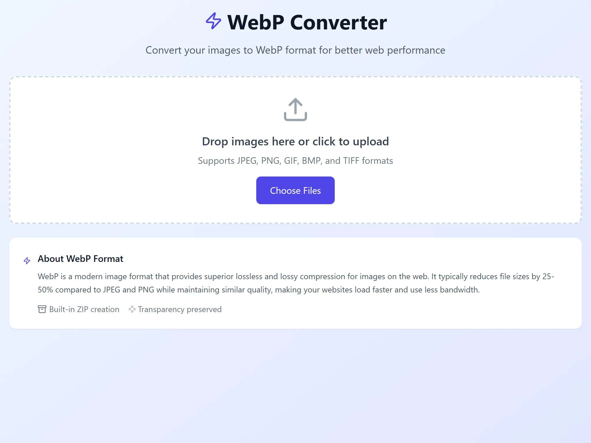

# 🖼️ WebP Image Converter

> A modern, fast, and secure image converter that transforms your images into the WebP format directly in your browser.

[](https://opensource.org/licenses/MIT)
[](https://www.typescriptlang.org/)
[](https://reactjs.org/)
[](https://vitejs.dev/)
[](https://tailwindcss.com/)



## ✨ Features

- 🚀 **Lightning Fast**: Client-side processing with HTML5 Canvas API
- 🖼️ **Smart Resizing**: Automatically resize images while maintaining aspect ratio
- 🎨 **Transparency Support**: Preserves alpha channels for PNG files
- 📦 **Batch Processing**: Convert multiple images simultaneously
- 💾 **Smart Downloads**: Auto-generates ZIP files for multiple conversions
- 🎯 **Quality Control**: Adjustable compression (10-100%)
- 📏 **Dimension Control**: Global and per-image resize settings with 2048px defaults
- 🔒 **Privacy First**: No server uploads - everything stays in your browser
- 📱 **Responsive Design**: Works seamlessly on all devices
- ⚡ **Modern Stack**: Built with React 19, TypeScript, and Vite
- 🛡️ **Security Focused**: Content Security Policy and input validation
- 📊 **File Insights**: Shows original vs compressed file sizes and dimension changes

## 🎯 Supported Formats

| Input Formats | Output Format            |
| ------------- | ------------------------ |
| JPEG, JPG     | WebP                     |
| PNG           | WebP (with transparency) |
| GIF           | WebP                     |
| BMP           | WebP                     |
| TIFF          | WebP                     |

## 🚀 Quick Start

### Prerequisites

- [Node.js](https://nodejs.org/) 18 or higher
- npm, yarn, or pnpm

### Installation

1. **Clone the repository**
   ```bash
   git clone https://github.com/yourusername/webp-image-converter.git
   cd webp-image-converter
   ```

2. **Install dependencies**
   ```bash
   npm install
   ```

3. **Start development server**
   ```bash
   npm run dev
   ```

4. **Open your browser**
   ```
   http://localhost:3000
   ```

## 🖼️ Image Resizing

The converter includes intelligent image resizing to help reduce file sizes while maintaining quality:

### **Global Resize Settings**
- **Default**: 2048px × 2048px maximum dimensions
- **Behavior**: Applied to all images automatically
- **Smart Scaling**: Only downsizes large images (never upscales)
- **Aspect Ratio**: Always preserved during resizing

### **Per-Image Control**
- **Individual Override**: Check the resize box for any image to use custom dimensions
- **Flexible Settings**: Each image can have different resize settings
- **Visual Feedback**: See original → final dimensions before conversion

### **How It Works**
1. **Upload images** → Automatically resized to global settings (2048px default)
2. **Adjust global settings** → Changes apply to all images without individual overrides
3. **Enable individual resize** → Check the box to set custom dimensions for specific images
4. **Apply to All** → Reset all images to use current global settings


## 📦 Available Scripts

| Command                | Description                  |
| ---------------------- | ---------------------------- |
| `npm run dev`          | Start development server     |
| `npm run build`        | Build for production         |
| `npm run preview`      | Preview production build     |
| `npm run type-check`   | Run TypeScript type checking |
| `npm run format`       | Format code with Prettier    |
| `npm run format:check` | Check code formatting        |

## 🏗️ Building for Production

```bash
# Build the project
npm run build

# Preview the build locally
npm run preview
```

The build outputs to the `dist/` directory and is ready for deployment to any static hosting service.

## 🚀 Deployment

### Netlify (Recommended)

This project is optimized for Netlify deployment with pre-configured headers and redirects.

1. **Deploy to Netlify**
   - Connect your GitHub repository to Netlify
   - Build command: `npm run build`
   - Publish directory: `dist`

2. **Environment Variables** (Optional)
   ```env
   NODE_VERSION=20
   ```

### Other Platforms

- **Vercel**: Works out of the box
- **GitHub Pages**: Compatible with static deployment
- **Cloudflare Pages**: Full support
- **Any static host**: Upload `dist/` folder contents

## 🛡️ Security Features

- **Content Security Policy**: Prevents XSS attacks
- **File Size Validation**: 50MB maximum file size
- **Dimension Limits**: 16,384px maximum width/height for input images
- **Resize Validation**: Smart bounds checking for custom resize dimensions
- **Input Sanitization**: Secure filename handling
- **Client-Side Only**: No data ever leaves your browser

## 🏗️ Project Structure

```
webp-image-converter/
├── public/
│   ├── favicon.png
│   └── ...
├── src/
│   ├── components/          # React components
│   ├── utils/              # Utility functions
│   │   └── zipUtils.ts     # ZIP file creation
│   ├── types.ts            # TypeScript definitions
│   ├── App.tsx             # Main application
│   ├── main.tsx            # Application entry point
│   └── index.css           # Global styles
├── dist/                   # Production build output
├── netlify.toml           # Netlify configuration
├── package.json           # Dependencies and scripts
├── tsconfig.json          # TypeScript configuration
├── tailwind.config.js     # Tailwind CSS configuration
└── vite.config.ts         # Vite configuration
```

## 🔧 Tech Stack

### Core Technologies
- **[React 19](https://reactjs.org/)** - UI framework with latest features
- **[TypeScript 5.6](https://www.typescriptlang.org/)** - Type-safe JavaScript
- **[Vite 6.x](https://vitejs.dev/)** - Lightning-fast build tool

### Styling & UI
- **[Tailwind CSS 3.4](https://tailwindcss.com/)** - Utility-first CSS framework
- **[Lucide React](https://lucide.dev/)** - Beautiful icons
- **CSS Grid & Flexbox** - Modern layouts

### Development Tools
- **[Prettier](https://prettier.io/)** - Code formatting
- **[PostCSS](https://postcss.org/)** - CSS processing
- **[Autoprefixer](https://autoprefixer.github.io/)** - CSS vendor prefixes

## 🤝 Contributing

Contributions are welcome! Please follow these steps:

1. **Fork the repository**
2. **Create a feature branch**
   ```bash
   git checkout -b feature/amazing-feature
   ```
3. **Make your changes**
4. **Run tests and formatting**
   ```bash
   npm run type-check
   npm run format
   ```
5. **Commit your changes**
   ```bash
   git commit -m 'Add amazing feature'
   ```
6. **Push to the branch**
   ```bash
   git push origin feature/amazing-feature
   ```
7. **Open a Pull Request**

## 📝 License

This project is licensed under the MIT License - see the [LICENSE](LICENSE) file for details.

## 🐛 Bug Reports & Feature Requests

Found a bug or have a feature idea? Please [open an issue](https://github.com/yourusername/webp-image-converter/issues) with:

- **Bug Reports**: Steps to reproduce, expected behavior, screenshots
- **Feature Requests**: Use case, proposed solution, mockups (if applicable)

## 📊 Performance

- **Bundle Size**: ~68KB gzipped
- **Load Time**: < 1 second on fast 3G
- **Processing Speed**: Depends on image size and device capabilities
- **Memory Usage**: Optimized with proper cleanup

## 🌟 Why WebP + Resizing?

**WebP Format Benefits:**
- **25-50% smaller** file sizes compared to JPEG/PNG
- **Better compression** with similar quality
- **Transparency support** like PNG
- **Wide browser support** (96%+ global coverage)

**Smart Resizing Benefits:**
- **Automatic optimization** for web use with 2048px defaults
- **Significant file size reduction** for large photos (4K+ images)
- **Maintained quality** through aspect ratio preservation
- **Flexible control** with global and per-image settings
- **Faster loading** websites and applications

## ❤️ Acknowledgments

- [React Team](https://reactjs.org/community/team.html) for the amazing framework
- [Vite Team](https://vitejs.dev/team/) for the incredible build tool
- [Tailwind CSS](https://tailwindcss.com/) for the utility-first CSS framework
- [Lucide](https://lucide.dev/) for the beautiful icons

---

<p align="center">
  Made with ❤️ by [Your Name]
</p>

<p align="center">
  <a href="#top">⬆️ Back to Top</a>
</p>
